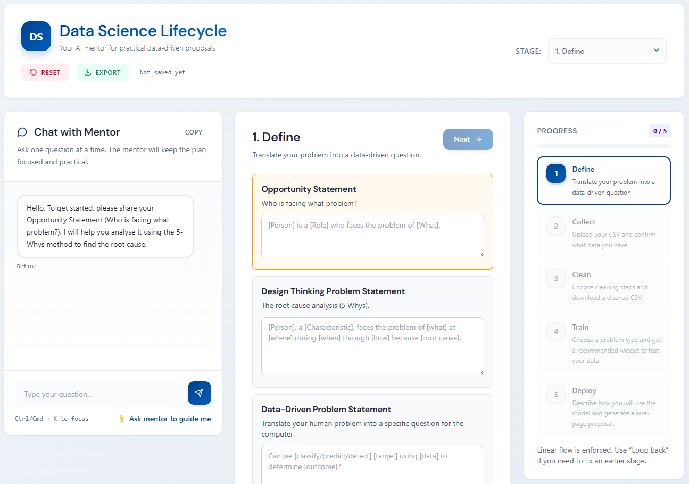

# DSLC Mentor Chatbot

[](https://nodejs.org)
[](LICENSE)

A single-file web application that guides students (ages 13-17) through the Data Science Lifecycle, helping them create professional project proposals with AI assistance.

[Features](#features) • [Getting started](#getting-started) • [Deployment](#deployment) • [Customisation](#customisation)



The DSLC Mentor Chatbot provides an interactive learning experience where students work through five structured stages — **Define → Collect → Clean → Train → Deploy** — with guidance from an AI mentor powered by Google Gemini. The chatbot helps students articulate research questions, design data collection plans, clean datasets, select appropriate algorithms, and generate a polished one-page proposal.

> [!TIP]
> There's no build step. The entire application runs from a single HTML file with zero dependencies beyond CDN-hosted libraries.

## Features

**Educational workflow**
- Linear five-stage progression designed for classroom use
- AI mentor provides contextual guidance at each stage
- Automatic progress saving (localStorage) across sessions

**Data handling**
- In-browser CSV upload, preview, and cleaning
- Interactive data quality analysis and recommendations
- Download cleaned datasets for use in widgets or other tools

**Deployment flexibility**
- Serverless architecture with Vercel or Firebase hosting
- LMS embedding support with configurable CSP
- No server-side processing required for core functionality

**Privacy-first design**
- All data processing happens in the browser
- Optional persistence for small datasets
- Secure API key management via environment variables

## Prerequisites

- **Google Gemini API key**: obtain one from [Google AI Studio](https://aistudio.google.com/apikey)
- **Hosting platform**: Vercel (recommended) or Firebase
- **Node.js 24+** (for deployment tools only)

## Getting started

### Quick test

The fastest way to try the application:

1. Clone the repository:
   ```bash
   git clone <repository-url>
   cd edu-proposal-chatbot
   ```

2. Open `public/index.html` directly in your browser
   > [!NOTE]
   > Without a Gemini API key, the chat features won't work, but you can explore the UI and stage structure.

### Deploy to Vercel

The recommended production deployment path:

1. Create a new Vercel project connected to this repository
2. Add the `GEMINI_API_KEY` environment variable in your project settings
3. Deploy (Vercel will serve the static files and automatically configure the serverless function)

The deployment will be available at `https://your-project.vercel.app`.

### Deploy to Firebase

Alternative deployment using Firebase Hosting and Functions:

1. Install dependencies in the `functions` directory:
   ```bash
   cd functions
   npm install
   cd ..
   ```

2. Configure Firebase:
   ```bash
   firebase login
   firebase use --add
   ```

3. Store your API key in Secret Manager:
   ```bash
   firebase functions:secrets:set GEMINI_API_KEY
   ```

4. Deploy:
   ```bash
   firebase deploy
   ```

> [!WARNING]
> If you have an existing Firebase site, create a separate hosting target to avoid overwriting it. See [FIREBASE_DEPLOY.md](docs/FIREBASE_DEPLOY.md) for detailed instructions.

## Deployment

### Vercel configuration

The `vercel.json` file includes:
- Content Security Policy (CSP) headers for LMS embedding
- No build command (serves `public/` directly)
- Automatic serverless function detection

### Firebase configuration

The `firebase.json` file configures:
- Hosting from the `public/` directory
- Function rewrite for `/api/gemini` endpoint
- Custom hosting target support

### Environment variables

Both platforms require the `GEMINI_API_KEY` environment variable:

**Vercel**: Add in Project Settings → Environment Variables

**Firebase**: Use Secret Manager:
```bash
firebase functions:secrets:set GEMINI_API_KEY
```

## Embedding in an LMS

The application is designed to work within learning management systems via iframe embedding.

### Basic iframe

```html
<iframe 
  src="https://your-deployment.vercel.app" 
  title="DSLC Mentor Chatbot" 
  width="100%" 
  height="1200" 
  style="border:0; min-height:600px;" 
  loading="lazy" 
  sandbox="allow-scripts allow-same-origin allow-forms" 
  referrerpolicy="no-referrer" 
  allow="clipboard-write">
</iframe>
```

### Content Security Policy

Update `vercel.json` to authorise your LMS domain:

```json
{
  "headers": [
    {
      "source": "/(.*)",
      "headers": [
        {
          "key": "Content-Security-Policy",
          "value": "frame-ancestors 'self' https://your-lms-domain.com;"
        }
      ]
    }
  ]
}
```

> [!NOTE]
> CSP `frame-ancestors` only accepts origins, not paths. For path-level access control, implement additional server-side validation.

## Customisation

### Modify mentor behaviour

The AI mentor's prompts and personality are defined in `public/index.html`:

- `buildSystemPrompt()` — general mentor behaviour and tone
- `buildProposalSynthesisSystemPrompt()` — proposal generation guidelines

Look for these functions to adjust:
- Response style and length
- Educational approach
- Domain-specific guidance

### Change the AI model

Edit the `model` constant in:
- `api/gemini.js` (Vercel)
- `functions/index.js` (Firebase)

Current model: `gemini-2.5-flash-preview-09-2025`

### Adjust data limits

Modify `MAX_CSV_BYTES_FOR_STORAGE` in `public/index.html` to change the localStorage threshold (default: ~4.5MB). Larger datasets are excluded from automatic persistence.

### Stage customisation

The five stages are defined in `STAGES` and implemented in `App.Stages.registry`. Modify these to:
- Add or remove stages
- Change progression requirements
- Customise UI components

## Project structure

```
├── public/
│   └── index.html          # Complete application (UI + logic)
├── api/
│   └── gemini.js           # Vercel serverless function
├── functions/
│   ├── index.js            # Firebase function
│   └── package.json        # Function dependencies
├── docs/
│   ├── FIREBASE_DEPLOY.md  # Detailed Firebase instructions
│   ├── using-dslc-chatbot.md  # User guide
│   └── images/             # Documentation screenshots
├── vercel.json             # Vercel configuration + CSP
├── firebase.json           # Firebase hosting configuration
└── package.json            # Project metadata
```

## Security and privacy

**Data storage**
- Session state saved to browser localStorage
- Large CSV files (>4.5MB) excluded from persistence
- No data transmitted to servers except Gemini API calls

**API key security**
- Never exposed in client code
- Managed via platform environment variables or Secret Manager
- Proxied through serverless functions

**Recommendations**
- Avoid uploading sensitive or personal data
- Clear browser data between student sessions on shared devices
- Review Gemini API [data usage policies](https://ai.google.dev/gemini-api/terms)

## Resources

**Documentation**
- [User guide](docs/using-dslc-chatbot.md) — step-by-step walkthrough for students
- [Firebase deployment guide](docs/FIREBASE_DEPLOY.md) — detailed hosting instructions
- [Proposal template](docs/proposal-template.md) — output format reference

**Technologies**
- [Google Gemini API](https://ai.google.dev/gemini-api/docs) — AI model provider
- [Vercel](https://vercel.com/docs) — serverless hosting platform
- [Firebase](https://firebase.google.com/docs) — alternative hosting and functions
- [Tailwind CSS](https://tailwindcss.com) — utility-first CSS framework
- [Papa Parse](https://www.papaparse.com) — in-browser CSV parsing

## Troubleshooting

**Chat not responding**
- Verify `GEMINI_API_KEY` is set correctly
- Check browser console for API errors
- Confirm serverless function logs for errors

**Progress not saving**
- Ensure localStorage is enabled
- Check browser privacy settings
- Note: Private/incognito mode prevents persistence

**LMS embedding issues**
- Verify CSP includes your LMS domain
- Check iframe sandbox attributes
- Confirm no conflicting X-Frame-Options headers

**Large CSV files**
- Files >4.5MB won't persist automatically
- Download cleaned data before navigating away
- Consider splitting datasets into smaller chunks

