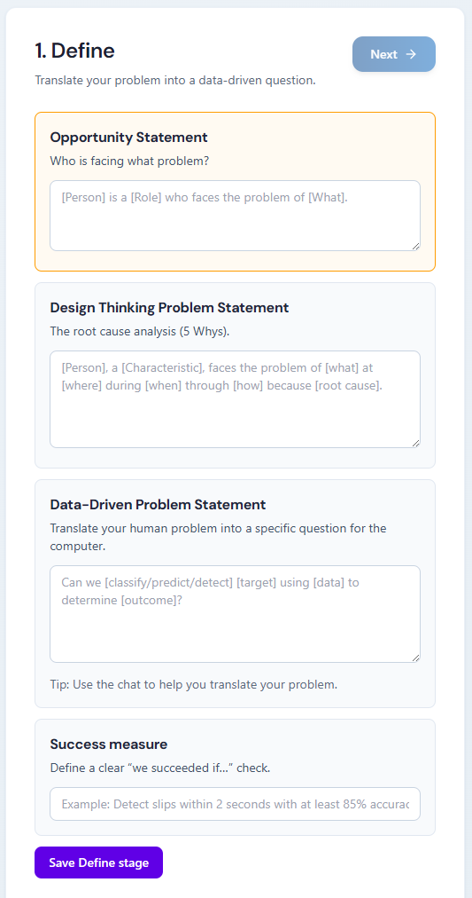
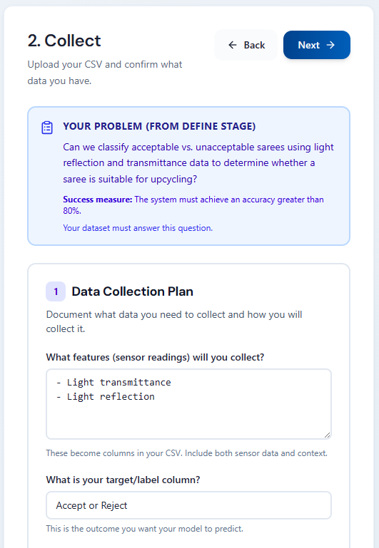

# Build Your Data Science Proposal

> **Learning objectives**
> - Navigate the five stages of the Data Science Lifecycle using an interactive chatbot
> - Upload and analyse a dataset with guidance from an AI mentor
> - Generate a professional project proposal that documents your data science approach

The Data Science Lifecycle (DSLC) chatbot is your digital mentor that guides you step by step from that initial Opportunity Statement to a complete project proposal. In this lesson, you'll explore how to structure your work and use the chatbot to create your own data science project proposal.

> 💡 Take your time with the chatbot. Revisit it often as your understanding of your project deepens and evolves.

> 💡 Progress is automatically saved locally in your browser. It will saved on the same device and browser across sessions but will be lost if you clear your browser data, use a different browser or device, or browse in private/incognito mode.

### Step 1 - Access the DSLC chatbot

1. Open the DSLC chatbot in a new tab: https://dslc-chatbot.web.app/

    Bookmark this page for future reference.

2. The chat panel on the left side is where you'll interact with your AI mentor.

3. The middle panel is where you will fill in the details for your proposal.

4. The right panel shows your progress through the five stages of the Data Science Lifecycle: Define, Collect, Clean, Train, and Deploy.

    

### Step 2 - Define your research question

1. You start at the **Define** stage.

    Read through the four segments that help you build your problem statement.

    Notice how each segment builds on the previous one, from broad opportunity to specific data question.

    > 📖 Professional data scientists use this funnel approach to move from human problems to computer-solvable questions.

    

2. Complete the **Opportunity Statement** text box.

    Use the structure '[Person] is a [Role] who faces the problem of [What]'
    
    Example: *Madam Suppiah is a founder of sareeUP who faces the problem of unused and discarded sarees ending up in landfills instead of being upcycled into new products.*

    > 💡 In the competition, you identify a person who has dedicated their life to a cause in their community.

3. Develop your **Design Thinking Problem Statement**.

    Use the structure '[Person], a [Characteristic], faces the problem of [what] at [where] during [when] through [how] because [root cause]'

    Example: *Madam Suppiah, a founder of sareeUP, faces the problem of too many unusable (faded/frayed) sarees clogging the upcycling pipeline at collection centers during sorting through subjective human judgment because there is a lack of objective, rapid assessment of fabric condition.*

    Discuss with the chatbot if you need help identifying the root cause.

    > 💡 The chatbot uses the 5-Whys technique to help you identify the root cause of a problem.

4. Create your **Data-Driven Problem Statement**.

    Translate your human problem into a specific question for the computer.

    Use the structure 'Can we [classify/predict/detect] [target] using [data] to determine [outcome]?'

    Example: *Can we classify acceptable vs. unacceptable sarees using light reflection and transmittance data to determine whether a saree is suitable for upcycling?*

    Use the chat to refine this statement until it's clear and data-focused.

5. Define your **Success measure**.

    Make it specific and measurable so you know if your solution works
    
    Example: *The system must achieve an accuracy greater than 80%.*

6. Select **Save Define stage** once you've completed all four segments. 

    This marks the Define stage as complete and unlocks the next stage.

### Step 3 - Collect and upload your dataset

1. Select **Next** to proceed to the **Collect** stage.

    Discuss with the chatbot to determine the following:

    - What features (or sensor readings) you will collect?
    - What is the target (or label) you want to predict or classify?
    - Define how you will create the labels for your data.
    - What other contextual information might be useful to collect?

    

2. As you discuss, remember to fill in the text boxes provided to document your data collection plan.

    These notes will be used to generate your proposal later.

    > 💡 If you have additional notes, you can use the **Stage Notes** text box to write notes for your reference.

3. When you're ready, select **Save Data Collection Plan** to record your work and unlock the next stage.

4. Now it's your turn to design the system to collect the data for your project. 

    Because this is a proposal, you can collect sample data or use existing datasets to simulate the data you would collect in a real project.

5. When you have your dataset ready, select **Choose CSV** and upload the dataset to the chatbot.

    The chatbot will analyse your data and help you understand its structure.

    > 💡 CSV (Comma-Separated Values) files are a standard format for storing tabular data. Most spreadsheet programmes can export to CSV.

    

6. Select **Confirm Plan & Continue** to save your work and unlock the next stage.

### Step 4 - Clean your data

1. The **Clean** stage prepares your data for analysis.

    Depending on your dataset, the chatbot will identify the following data quality issues:

    - Missing values
    - Outlier values
    - White space
    - Inconsistent labels
    - Encoding problems
    
    > 💡 Real-world data is messy. Professional data scientists often spend 50-70% of their time cleaning data before analysis.

2. Make decisions about missing values.

    Use the chatbot to help you understand the implications of each choice.

3. When you're ready, select **Apply cleaning**.

    Then select **Download cleaned CSV** to save the processed file.

    > ⚠️ Keep both your original and cleaned datasets. You might need to try different cleaning approaches later.

### Step 5 - Explore training recommendations

1. In the **Train** stage, select one of three options: **Predict a number**, **Predict a category**, or **Find groups (no labels)**

    > 💡 The chatbot recommends different algorithms depending on whether you're predicting numbers (regression), categories (classification), or finding patterns (clustering).

2. Open the recommended widgets and upload your cleaned dataset.

    Record the accuracy of your experiments in the widgets, and then return to the chatbot to document your findings.

3. Select **Save Train stage** to record your work and unlock the final stage, which is to generate your proposal.

### Step 6 - Plan deployment and generate your proposal

1. Select the **Deploy** stage to document how you willi implement the project and to create your final proposal.

    There are four text boxes that help you think about real-world implementation.

    > 💡 A proposal is a professional document that explains your project plan to others. Scientists, engineers, and researchers write proposals to communicate their ideas.

    **Deployment context**
    - Describe where your model will run and who will use it.
    - Example: *The system will run at a SareeUP centre with someone monitoring the sarees being identified by the system.*
    - Think about the physical or digital environment.

    **Alerts and action**
    - Explain what happens after the model makes a prediction.
    - Example: *If accepted, the Green LED turns on. If rejected, the Red LED turns on.*
    - Consider how your system will communicate results to users.
    
    > 💡 Remember this is a proposal, so keep your initial prototype simple and focused.

    **Risk and safety**
    - Describe what could go wrong with your system.
    - Explain your safety plan for handling mistakes.
    - Example: *If it misses an event, we will review the sensor logs and retrain with that data.*

    **Improve the model**
    - Explain how you will make it better after initial testing.
    - Example: *Collect 50 more examples in different lighting conditions and retrain.*
    - Think about continuous improvement over time.

2. Select **Generate Proposal** to create your proposal based on all the information you've documented.

3. Download and review your proposal.

    Check that it accurately reflects your Define stage problem, dataset, cleaning steps, algorithm choice, and deployment plans.
    
    > ⚠️ This proposal is a starting point, not a finished product. You should review and personalise it further before submitting.

